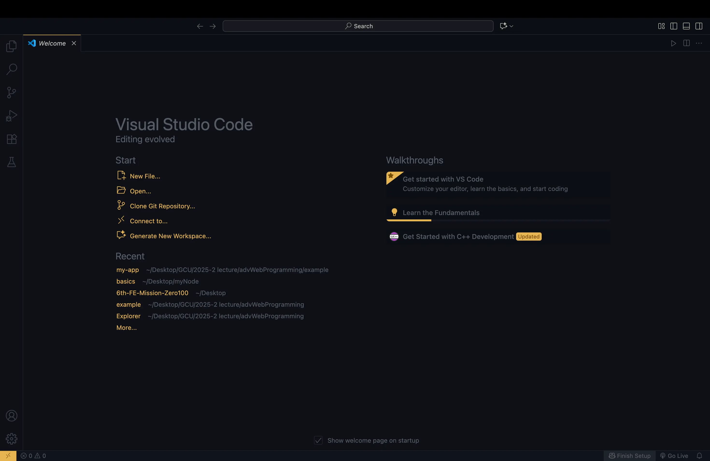

### Ch1 노드 시작하기

# 핵심 개념 이해하기

<aside>

Node.jssms 크롬 V8 자바스크립트 엔진으로 빌드된 자바스크립트 런타임입니다. 
</aside>

**서버** : 네트워크를 통해 클라이언트에 정보나 서비스를 제공하는 컴퓨터 또는 프로그램을 말함

**런타임** : 특정 언어로 만든 프로그램들을 실행할 수 있는 환경

**libuv라이브러리** : 노드의 특성인 이벤트 기반, 논블로킹I/O모델을 구현하고 있음

📌 번과 디노도 좀 눈여겨보면 좋을 JS런타임… 

## 이벤트 기반

→ 이벤트(클릭, 네트워크 요청 등)가 발생할 때 미리 지정해둔 작업을 수행하는 방식 

### 순서

1. 이벤트 리스너에 콜백함수 등록 - 특정 이벤트가 발생할 때 무엇을 할지 미리 등록해두는 것
2. 이벤트 발생
3. 등록된 콜백 함수 호출
4. 발생한 이벤트가 없거나 발생한 이벤트를 다 처리하면 노드는 다음 이벤트까지 대기함

### 이벤트 루프 / 백그라운드 / 태스크 큐

📌 ***이벤트 루프***

- 이벤트 발생 시 호풀할 콜백함수들을 관리하고, 호출된 콜백삼수의 실행순서를 결정함
- 노드가 종료될 때까지 이벤트 처리를 위한 작업을 반복함
- 이벤트 루프는 호출 스택이 비어 있을 때만 태스크 큐에 있는 함수를 호출스택으로 가져옴 → 즉, 호출스택에 함수가 너무 많이 들어있으면 setTimeout(run, 3000)에서 3초가 지나 태스크큐에 run함수가 있다 하더라도 이벤트 루프는 호출스택에 run함수를 넣지 않음

📌 ***백그라운드***

- setTimeout같은 타이머나 이벤트 리스너들이 대기하는 곳
- 여러 작업이 동시에 실행될 수도 있음

📌 ***태스크 큐***

- 이벤트 발생 후, 백그라운드에선 태스크 큐로 타이머나 이벤트 리스너의 콜백함수들을 보냄

## 논블로킹 I/O

I/O작업 예시 : 파일 시스템 접근(파일 읽기 및 쓰기, 폴더 만들기 등), 네트워크를 통한 요청 등

논블로킹 : 이전 작업이 완료될 때까지 대기하지 않고 다음 작업을 수행하는 것 → JS에서는 I/O작업 같은 것이 동시처리가 가능함

블로킹 : 이전 작업이 끝나야만 다음 작업을 수행함

`setTimeout(콜백, 0)` : 코드를 논블로킹으로 만들기 위해 사용하는 기법 중 하나

🧐 0ms면 바로 실행되는 거 아닌가요? : 아님, 브라우저와 노드 사이엔 기본적인 지연시간이 있기 때문에 바로 실행되지 않음

# 서버로써의 노드

### 장점

- JSON형식과 쉽게 호환됨
- I/O작업이 많은 서버로 적합
- 웹서버 내장

### 단점

- CPU작업이 많은 서버로는 부적합
- 하나뿐인 스레드가 멈추지 않도록 관리가 필요함
- 서버 규모가 커졌을 때 서버를 관리하기가 어려움

# 개발환경 설정하기

### node와 npm 설정

`node -v` 명령어 입력 → v22.19.0

`npm -v`명령어 입력 → 10.9.3

### vscode 설치

# 🧐 질문
1. 본문에서 libuv가 이벤트 기반, 논블로킹 I/O를 구현한다고 했는데, 그렇다면 libuv와 이벤트 루프는 정확히 어떤 관계인 걸까?
2. 서버 규모가 커졌을 때 관리가 어려운 이유는 구체적으로 무엇일까? - 막연히 '관리가 어렵다'고 되어 있는데 정확히 어떤 부분에서 관리가 어려워지는 걸까?
3. 번과 디노는 왜 등장하게 된 거지? Node.js의 어떤 부분을 보완하기 위해 나온 걸까?